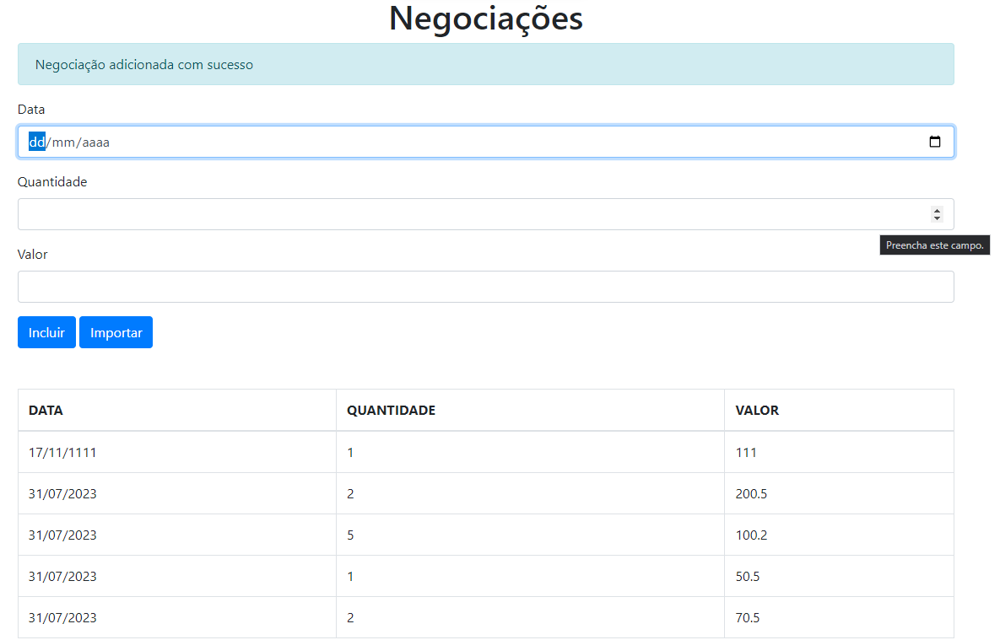

<h2>Aplicação de Negociações em Bolsa de Valores</h2>

Finalização da aplicação de negociações em bolsa de valores utilizando TypeScript como linguagem de programação - TypeScript Learning Project. 

Esse projeto foi desenvolvido em três fases:

<h3>Primeira fase - TypeScript básico: </h3>

- Implementação do cadastro de negociação, onde o usuário pode inserir uma data, uma quantidade e um valor para cadastrar uma negociação na aplicação.
- Tratamento da imutabilidade dos dados, com aplicação de soluções para garantir que os dados da negociação não possam ser modificados após o cadastro. As soluções implementadas incluem:
    * Utilização de getters
    * Declaração no constructor
    * Atribuição privada (private)
    * Atribuição pública com o modificador readonly
    * Programação defensiva

<h3>Segunda fase - TypeScript intermediário:</h3>

- Utilização de modificadores de acesso, herança e tipos genéricos
- Definição e utilização das Enumerations
- Criação de um mini framework de atualização de view inspirado no JSX
- Configuração do compilador TS visando a otimização do código

<h3>Terceira fase - TypeScript avançado:</h3>

- Uso de Decorators para um código mais elegante
- Uso de interfaces e seus benefícios
- Organizar e adicionar tipo em seu código ao consumir uma API REST
- O papel de sourceMaps e para debugar a aplicação no navegador
- Criação de soluções
- Benefício do Polimorfismo para garantir um código protegido e dinâmico

<h3>Como Executar a Aplicação:</h3>
Para executar a aplicação, siga os passos abaixo:

Certifique-se de ter o ambiente Node.js instalado em sua máquina.

Clone este repositório para o seu computador.

Navegue até a pasta do projeto e instale as dependências utilizando o gerenciador de pacotes do Node.js (npm ou yarn).

Execute o comando "npm run start" ou "yarn start" para iniciar a aplicação.

Abra outro terminal, navegue até a pasta servidor-api, faça "npm install" e em seguida "npm start" - o banco vai rodar na porta 8080.

Acesse a aplicação através do navegador utilizando o endereço http://localhost:3000 (ou outra porta, caso especificada no terminal).

<h3>Contribuições:</h3>

Contribuições são bem-vindas! Se você tem alguma ideia de melhoria ou correção de bugs, sinta-se à vontade para abrir uma issue ou enviar um pull request.
